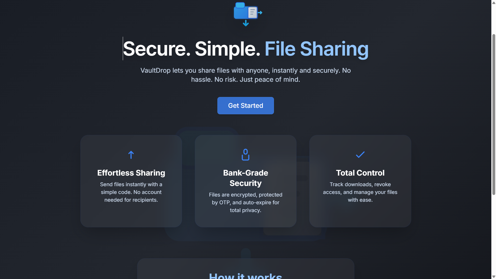
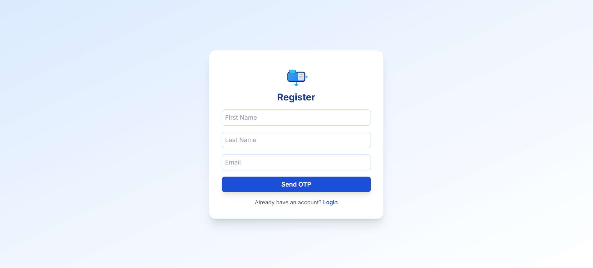

# VaultDrop

A modern, secure, and user-friendly file sharing platform. Instantly share files with anyone using access codes and OTP protection. Built with a premium UI, robust dark mode, and advanced admin features.

## Features
- 🔒 **Bank-grade security**: Files are encrypted, protected by OTP, and auto-expire for privacy.
- 🚀 **Effortless sharing**: Share files instantly with a simple code—no account needed for recipients.
- 📊 **Admin dashboard**: Analytics, user management, and file tracking.
- 🌗 **Dark mode**: Beautiful, accessible dark/light themes with a premium toggle.
- 📁 **File management**: Upload, preview, share, and track download history.
- 🖥️ **Modern UI**: Responsive, minimalist design inspired by top SaaS products.

## Tech Stack
- **Frontend**: React, Tailwind CSS
- **Backend**: Node.js, Express, MongoDB
- **Auth**: JWT, OTP via email

## Getting Started

### Prerequisites
- Node.js (v18+ recommended)
- MongoDB

### Installation
1. **Clone the repo:**
   ```sh
   git clone https://github.com/HumanshuIse/vaultdrop.git
   cd vaultdrop
   ```
2. **Install dependencies:**
   ```sh
   cd client && npm install
   cd ../server && npm install
   ```
3. **Set up environment variables:**
   - Copy `server/.env.example` to `server/.env` and fill in your values.
4. **Start the servers:**
   - In one terminal:
     ```sh
     cd server
     npm start
     # or: node server.js
     ```
   - In another terminal:
     ```sh
     cd client
     npm start
     ```
5. **Visit** [http://localhost:3000](http://localhost:3000)

## Screenshots



## License
MIT

---
Made with ❤️ by HumanshuIse
